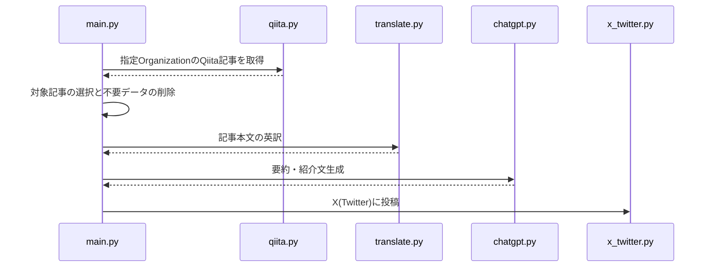

# post_qiita_summary

## 導入
[会社のQiita Organization](https://qiita.com/organizations/wakuto-inc) を作成し、[技術広報用のXアカウント](https://twitter.com/wakuto_kurokawa) を作ったので、OrganizationメンバーのQiita記事を紹介する仕組みを用意しようと思いつき、簡単に実装してみました。

## 背景
このプログラムの目的は、弊社メンバーのQiita記事をより多くの人々に届けるための自動化システムを構築することです。コストをできるだけ抑えたかったので、ChatGPT APIのトークン数を節約するために記事を英語に翻訳してから処理しています。

## 技術スタックとプログラム構成
- **言語とプラットフォーム**: Python, Cloud Functions for Firebase
- **主要なモジュール**:
  - `main.py`: プログラムのエントリーポイントとスケジューラー
  - `qiita.py`: Qiita APIを使用して記事を取得
  - `translate.py`: Google Translate APIを利用して記事を英訳
  - `chatgpt.py`: ChatGPT APIを使用して記事の要約を生成
  - `x_twitter.py`: Twitter APIを利用して投稿処理

## 処理フローとシーケンス図
### 処理フロー
1. `main.py` が `qiita.py` を呼び出してQiitaの記事を取得
2. `translate.py` で英語に翻訳
3. `chatgpt.py` で要約を生成
4. `x_twitter.py` でTwitterに投稿

### シーケンス図

この仕組みで一日一回つぶやいていますので、興味のある方は各投稿本文と生成された紹介文を見比べてみてください。
https://twitter.com/wakuto_kurokawa

---
ほぼ同じ内容ですが、Qiitaにも記事を書いているのでよかったらいいねお願いします。
